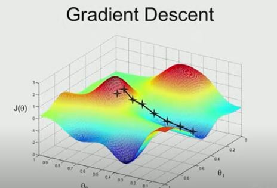

# Lecture 2 - Stanford CS229- Machine Learning - Linear Regression and Gradient Descent

**Supervised Learning Process**
- Training set
- Learning algo
- function
- hypothesis (h)

example:
size of house -> [h] -> estimated price

**Design Choices**
- key decisions you have to make
- workflow
- what's the dataset?
- what's the hypothesis?
- How do you represent the hypothesis?
    - single input
    - multiple input

**Learning Algo**
- Job
    - choose parameters θ that allows you to make good predictions
- choose θ such that `h(x) ~ y` for training example

**Definition**
- θ = parameters
- M = # training examples
    = # rows in table above
- X = input / features
- Y = output / target variable
- (x,y) = training example

**Gradient Descent**
- Starting with some θ
- Keep changing θ to reduce J(θ)

